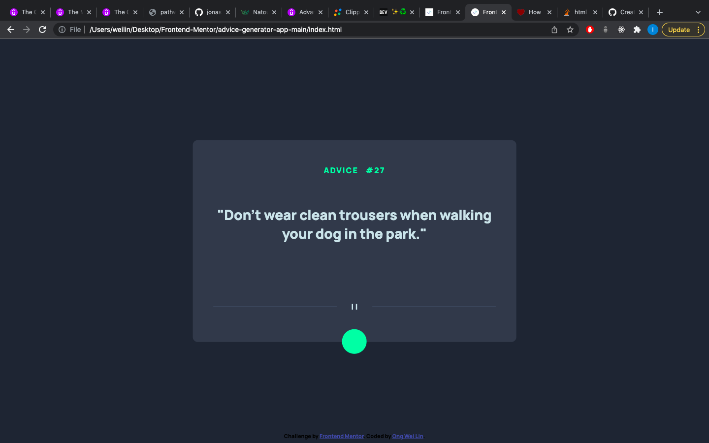

# Frontend Mentor - Advice generator app solution

This is a solution to the [Advice generator app challenge on Frontend Mentor](https://www.frontendmentor.io/challenges/advice-generator-app-QdUG-13db). Frontend Mentor challenges help you improve your coding skills by building realistic projects.

## Table of contents

- [Overview](#overview)
  - [The challenge](#the-challenge)
  - [Screenshot](#screenshot)
  - [Links](#links)
- [My process](#my-process)
  - [Built with](#built-with)

## Overview

### The challenge

Users should be able to:
- click on round green button at the bottm of the adivce box

### Screenshot

### Links

- Solution URL: [https://www.frontendmentor.io/solutions/advice-generator-using-jquery-ajax-and-flexbox-S1Igf4Cf5] (https://www.frontendmentor.io/solutions/advice-generator-using-jquery-ajax-and-flexbox-S1Igf4Cf5)
- Live Site URL: [https://weilin93.github.io/advice-generator-app/] (https://weilin93.github.io/advice-generator-app/) 

## My process

### Built with

- Semantic HTML5 markup
- CSS custom properties
- Flexbox
- Jquery
- AJAX

